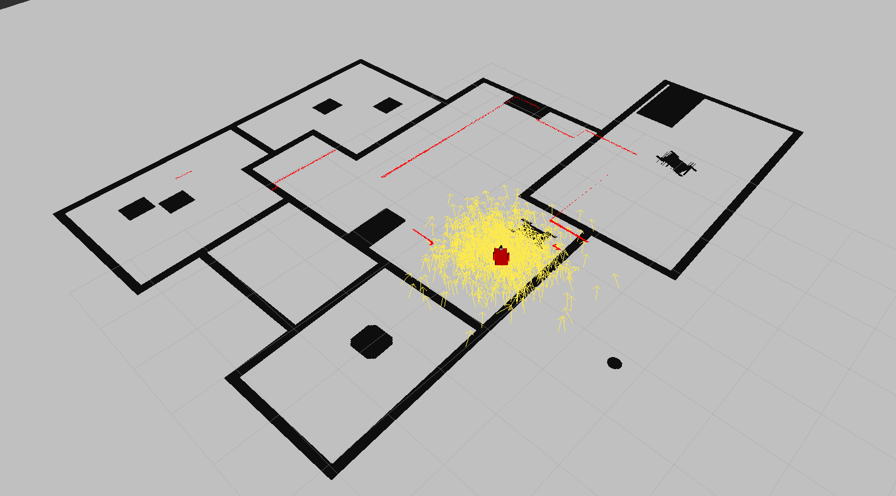
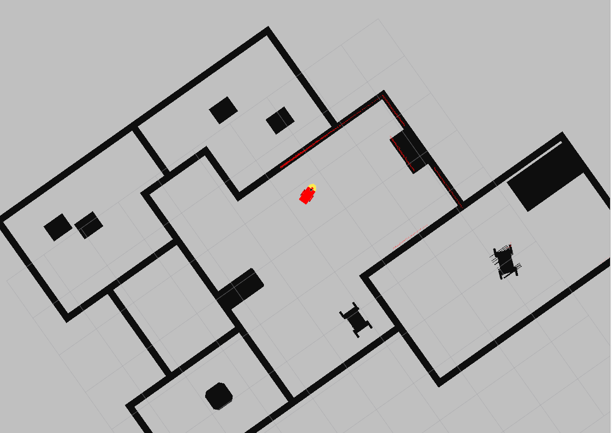
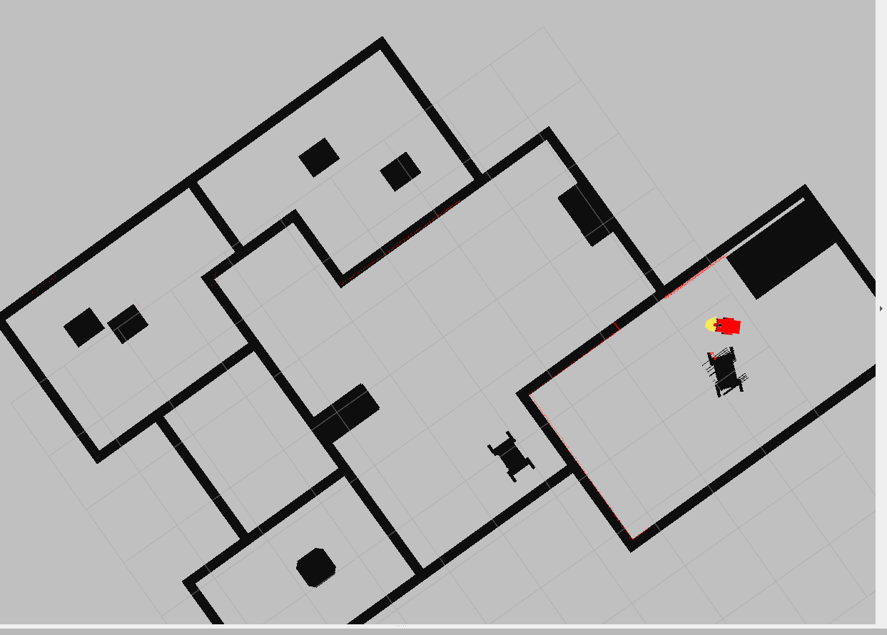

# Where am I

> This is a project where a robot localizes itself using amcl with a known map.

This project uses the robot and environment models found [here](https://github.com/lemontyc/my_robot). It uses ros [amcl](http://wiki.ros.org/amcl) to localize itself on a map built with this [tool](https://github.com/udacity/pgm_map_creator).


## Requirements

While this package was created on Ubuntu 20.04, it seems it is crashing because of an update. Try running it in Ubuntu 16.04.
* Required ROS packages:
```sh
$ sudo apt-get install ros-<YOUR ROS VERSION>-navigation
$ sudo apt-get install ros-<YOUR ROS VERSION>-map-server
$ sudo apt-get install ros-<YOUR ROS VERSION>-move-base
$ sudo apt-get install ros-<YOUR ROS VERSION>-amcl
```

## Running
1. Clone this package to your ``<ROS_workspace/src>``
2. Compile:
```sh
$ catkin_make
```
3. Launch world:
```sh
$ roslaunch my_robot world.launch
```
3. Launch localization:
```sh
$ roslaunch my_robot amcl.launch
```
The robot should not be well localized at start (orange arrows are the estimated pose):



After sending 2D navigation goals, robot should localize very well:




## Meta

* **Luis M.**           - [GitHub](https://github.com/lemontyc)


Distributed under the MIT License. See ``LICENSE`` for more information.

This project was developed for the **Robotics Software Engineer** nanodegree at **Udacity**.

